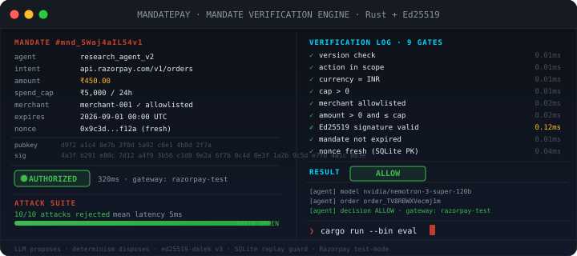

# MandatePay

> **Live demo (frontend): https://mandatepay-five.vercel.app**
> Dashboard is statically hosted on Vercel. Point it at your API with `?api=https://your-backend` (e.g. `https://mandatepay-five.vercel.app/?api=http://127.0.0.1:8080`), or run the backend locally below. Backend Rust API allows CORS `*` for demo.

[](https://mandatepay-five.vercel.app)

<div align="center">

</div>

[](https://github.com/amrav69/mandatepay/actions/workflows/ci.yml) [](https://www.rust-lang.org) [](LICENSE)   

**Signed payment mandates for AI agents — Ed25519 intent mandates with spend caps, expiry & replay protection, verified before any Razorpay order.**


> AI agents can now act while you sleep with live API keys. Valid credentials ≠ valid payment. MandatePay is the cheque book: every money action needs a bounded, single-use, signed mandate first.

Built for **Razorpay AI Buildathon 2026 — Track 01: Agentic Commerce**. The same seam protects every track.

## Why now

Razorpay calls 2026 the age of agentic payments: ACP/AP2/x402 and NPCI's UAP are converging on agent-to-agent commerce. When agents hold keys, credential validity stops being the security boundary — action validity does. MandatePay answers *should this agent move this money, right now?*

## Quick start

```bash
# 0. live frontend (no install): https://mandatepay-five.vercel.app
#    connect to local API: https://mandatepay-five.vercel.app/?api=http://127.0.0.1:8080

# 1. server + dashboard (http://127.0.0.1:8080)
cargo run --bin mandatepay

# 2. in another terminal — Nemotron buyer agent (needs LLM_API_KEY in .env)
cargo run --bin agent

# 3. adversarial suite against the live server (needs MANDATEPAY_SEED in .env — see .env.example)
cargo run --bin eval
```

`.env` is gitignored. Copy `.env.example` → `.env` and fill:
- `LLM_API_KEY` — NVIDIA `nvapi-...` for Nemotron 3 (free at build.nvidia.com)
- `RAZORPAY_KEY_ID` / `RAZORPAY_KEY_SECRET` — `rzp_test_...` from dashboard.razorpay.com → Settings → API Keys (test mode). Absent → mock gateway.
- `MANDATEPAY_SEED` — base64 32 bytes, fixes authority key. Absent → ephemeral key per boot.
- `ALLOWED_MERCHANTS` — comma list, default `merchant-001`.

## Repo layout

```
mandatepay/
├── src/
│   ├── mandates.rs        # Mandate schema, canonical bytes, Ed25519 sign/verify
│   ├── policy.rs          # 13-gate evaluation: version/action/currency/max>0/expires>issued/ids/issued-leeway/expiry/sig/allowlist/amount>0/amount<=cap/nonce
│   ├── store.rs           # SQLite ledger: decisions + nonces + orders + agents + velocity
│   ├── gateway.rs         # Gateway seam: Mock ↔ Razorpay test-mode (basic auth /v1/orders)
│   ├── auth.rs            # Master key + per-agent key extraction/verification
│   ├── error.rs           # Typed HTTP errors (400/401/403/404/500)
│   ├── app.rs             # Axum handlers + router (agent-key + master-key zones)
│   ├── lib.rs             # Crate root
│   ├── main.rs            # Boot: seed, gateway, ledger, master key, bind
│   └── bin/
│       ├── agent.rs       # Nemotron buyer: proposals, wallet guard, least-privilege mandate
│       ├── chaos.rs       # 10-task concurrent idempotency harness
│       └── eval/          # 10-vector HTTP attack suite (main.rs + vectors.rs)
├── dashboard/index.html   # Live decision stream, polling every 2s, replay viewer
├── gen_card.py            # Generates mandate_card.svg (ILLUSTRATIVE diagram, not eval output)
├── tests/                 # mandates/store/common/eval_issue/eval_checkout/logging/fresh_clone
└── .github/workflows/ci.yml  # Pinned SHAs: fmt → clippy → tests → coverage → audit → live suite
```

## Architecture

```
LLM (Nemotron 3 on integrate.api.nvidia.com)
 │  proposes {item, merchant_id, amount_minor, reasoning}  (JSON only)
 ▼
Agent (src/bin/agent.rs) ── wallet guard: amount ≤ AGENT_BUDGET_MINOR ──▶ POST /v1/mandates
                                                                    │
Authority (mandates.rs) ◀── Ed25519 SigningKey (MANDATEPAY_SEED) ────┘
 │  signs canonical_bytes(mandate) → 64B sig
 ▼
Mandate + signature + amount_minor ──POST /v1/checkout──▶ Policy Engine (policy.rs)
                                                         │  13 gates: version / action / currency / max>0
                                                         │          expires>issued / non-empty ids / issued_at leeway
                                                         │          expiry / sig verifies / allowlist
                                                         │          amount>0 / amount≤cap / nonce fresh
                                                         ▼
                                                   SQLite (store.rs)
                                                   ├─ nonces (PRIMARY KEY; first spend creates 1 order,
                                                   │          identical resubmit → ALLOW cached, else REJECT)
                                                   └─ decisions (append-only hash-chained audit trail)
                                                         │
                                          ┌────────────────┴────────────────┐
                                          ▼                                 ▼
                                    Gateway (gateway.rs)              Dashboard (dashboard/index.html)
                                    Mock  ↔  Razorpay test-mode      polls /v1/decisions + /v1/stats every 2s
                                    live:false / live:true            click row → replay payload + reason
```

**Trust boundaries — LLM proposes, determinism disposes:**

| Component | Can do | Cannot do |
|---|---|---|
| **Nemotron** | Output a JSON proposal | Touch keys, sign, or call Razorpay |
| **Agent** | Validate proposal vs wallet, request mandate, submit checkout | Exceed `AGENT_BUDGET_MINOR`, bypass policy |
| **Authority** | Sign mandates with `SigningKey` | Decide if a spend is allowed |
| **Policy Engine** | `ALLOW/REJECT` with reason | Move money |
| **Gateway** | `POST https://api.razorpay.com/v1/orders` with basic auth | Override a `REJECT` |
| **Store** | Enforce nonce uniqueness via `PRIMARY KEY` | Allow replay to succeed — even a valid signature replays as `REJECT` |

**Two-factor — mandate + per-agent API key (deliberate):** `POST /v1/mandates` and `POST /v1/checkout` require *both* a valid Ed25519 `signature` (proves *what* is authorized — bounded, expiring, single-use) *and* the per-agent `X-API-Key`/`Bearer` for the body `agent_id` (proves *who* may submit — verified against `agents.api_key_hash` with constant-time compare; 401 missing/unknown, 403 mismatch). The master `MANDATEPAY_API_KEY` authorizes `/v1/agents*` management only (create/rotate/update/delete/list); per-agent keys are issued once via `POST /v1/agents` and rotated via `POST /v1/agents/{id}/rotate`. The signature alone would let anyone who steals a mandate replay it; any single shared key would let any caller impersonate any agent. Together they are the design, not a leftover — the dashboard's key is demo-only and never logged.

**Gateway seam:** `Gateway::from_env()` reads `RAZORPAY_KEY_ID/SECRET`. Present → `Razorpay { basic_auth, live:true, receipt=mandate_id }`, absent → `Mock { live:false }`. Checkout code calls `gateway.create_order()` blind — the swap is one `match` arm in `src/gateway.rs:1`.

**Deterministic seed:** `MANDATEPAY_SEED` (base64 32B) fixes the authority key. Server and `cargo run --bin eval` share it, so the harness can mint *validly signed* hostile mandates — the strongest attack class. No seed → ephemeral key per boot (fine for demos, eval refuses to run).

## Evaluation

Run against a live server (`MANDATEPAY_SEED` shared, `RAZORPAY_KEY_ID` present → live test-mode):

```
======================================================================
 MANDATEPAY ATTACK SUITE — every vector must end in REJECT
 (replay shows its ACTUAL decision: ALLOW idempotent or REJECT)
======================================================================
 control: API issued a legitimate mandate in 7 ms
 control: legitimate checkout 320 ms -> ALLOW (must be ALLOW)
----------------------------------------------------------------------
 replay setup: first spend 94 ms -> ALLOW (expected ALLOW)
 attack                     vector                                        ms  decision  reason
----------------------------------------------------------------------
 forged_signature           random 64B signature on valid mandate          3  REJECT    invalid signature
 tampered_mandate_field     cap raised after signing, original sig ke…    11  REJECT    amount exceeds agent policy
 over_cap_amount            checkout amount 10x above signed cap           3  REJECT    amount exceeds agent policy
 zero_amount                checkout for 0 paise                           2  HTTP-ERROR amount_minor must be positive
 replay                     identical checkout resubmitted                11  ALLOW     idempotent replay: cached order returned
 expired_mandate            validly signed but expired window             11  REJECT    mandate expired
 non_allowlisted_merchant   validly signed mandate for unknown mercha…     3  REJECT    merchant not allowlisted
 out_of_scope_action        signed action=payout outside governor sco…     2  REJECT    action outside governor scope
 unsupported_version        signed future mandate version                  3  REJECT    unsupported mandate version
 malformed_signature        signature field is not valid base64            2  REJECT    invalid signature
----------------------------------------------------------------------
 attacks rejected: 10/10   mean decision latency: 5 ms
 control legitimate checkout: ALLOWED (320 ms)
 SUITE GREEN
```

Four attacks are *validly signed* hostile mandates — they prove the layers beyond the signature: expiry, allowlist, scope, and version. Latencies above are illustrative from a past run (yours will vary; mock is single-digit ms, live Razorpay adds `~300 ms` network cost). The replay row shows its actual decision: identical resubmission returns `ALLOW` with the cached order (at-most-once), which counts as pass. Error strings are generic by design (no cap/merchant oracle).

**Chaos — at-most-once under concurrency (`cargo run --bin chaos`):**

```
 MANDATEPAY CHAOS — 10 concurrent checkouts on the SAME mandate
 Expected: at-most-once with idempotent replay — allow+reject==10, 1 unique order, allow>=1
 ...
 result: allow+reject==10, unique orders: 1
 CHAOS GREEN — at-most-once held under concurrent race (idempotent replay allowed)
```

The harness fires 10 concurrent `POST /v1/checkout` with the same `mandate_id`. Correct invariant is `allow+reject==10, 1 unique order, allow>=1` — after the first checkout creates the order, concurrent retries that hit the early idempotency cache correctly return `ALLOW` with `cached order returned` instead of `REJECT`. The strict `1 ALLOW / 9 REJECT` expectation is outdated.

**Agent demo (real Nemotron 3 Super):**

```
[agent] model nvidia/nemotron-3-super-120b-a12b responded in 4232 ms
[agent] proposal: {"item":"wired earphones","merchant_id":"merchant-001","amount_minor":45000,...}
[agent] mandate issued: "mnd_SWaj4aIL54v1"
[agent] decision: ALLOW
[agent] gateway: razorpay-test
[agent] order: order_TV8RBWXVecmj1m
```

Visible in Razorpay Dashboard → Orders (test mode). `gateway: mock` vs `razorpay-test` is surfaced in every `POST /v1/checkout` response and in the dashboard.

## What's real vs simulated

| Real | Simulated | Not claimed |
|---|---|---|
| `mandates.rs` JCS (`serde_jcs`) + `ed25519-dalek v3` sign/verify; `policy.rs` 13 gates (shared stateless validator + nonce claim); `store.rs` SQLite `PRIMARY KEY` replay + atomic `PENDING` order reservation; per-agent keys (`agents.api_key_hash`); `agent.rs` live Nemotron via `integrate.api.nvidia.com` (JSON-only, wallet guard + least-privilege mandate + fallback); `gateway.rs` `POST https://api.razorpay.com/v1/orders` basic auth when `RAZORPAY_KEY_ID` present; `dashboard/index.html` polling `/v1/decisions` + `/v1/stats` (nonce-redacted unless master key); CI (SHA-pinned) boots a server with `CI_SEED` and must get `SUITE GREEN` | Merchant catalog is synthetic (`merchant-001` default allowlist, no real catalog API); orders are test-mode (`rzp_test_`); `gateway: mock` path when no keys — same response shape, `live:false`; budget/goal are env defaults; `mandate_card.svg` is an illustrative diagram from `gen_card.py`, not eval output | Production Razorpay deployment, production key management/HSM, Vortex access, access to Razorpay's internal risk models. This composes *with* platform fraud, not instead of it. |

Honesty is the bar — the attack *vectors* above are what `cargo run --bin eval` runs on the commit you are reading; latencies vary by machine. `mandate_card.svg` is illustrative (see `gen_card.py` header).

## Known limitations

- `nonces` and `decisions` tables grow without TTL pruning — `store.rs` never deletes expired nonces or mandates. For a demo this is fine; for production add a nightly `DELETE FROM nonces WHERE claimed_at < now - 86400*7` and a `decisions` retention job.
- Velocity windows are fixed windows aligned to epoch multiples (`window_start = now - now % window`), not sliding windows. Budgets reset on window boundaries by design; see `check_velocity`.

## License

MIT
